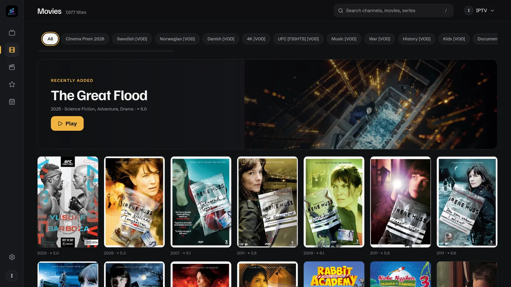
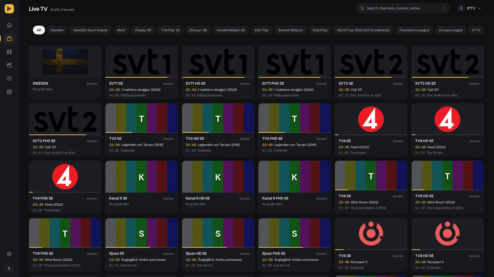
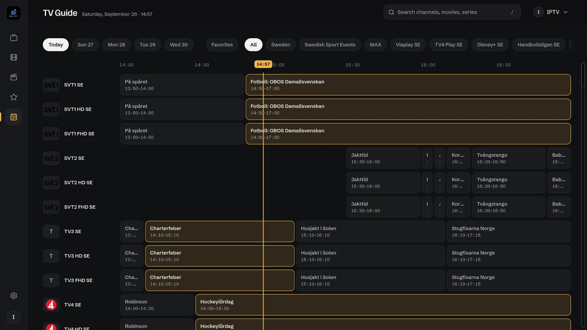
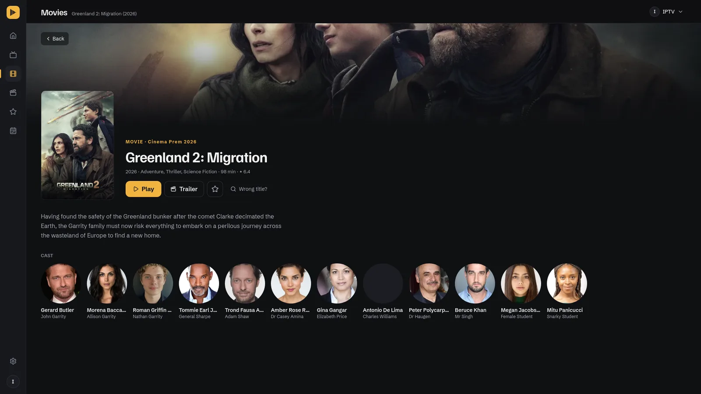
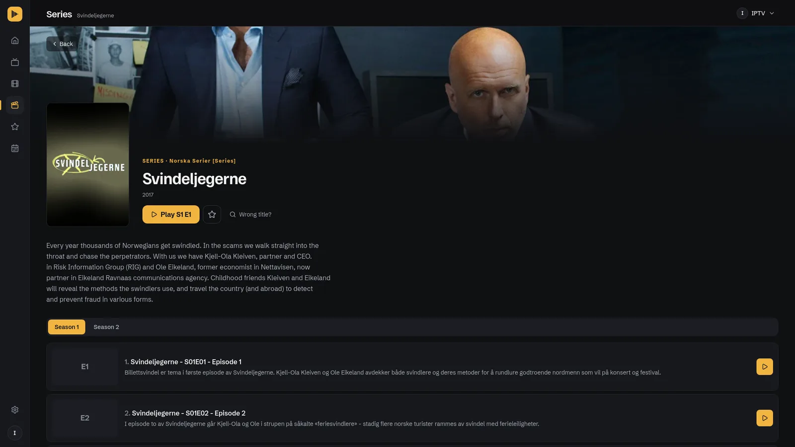
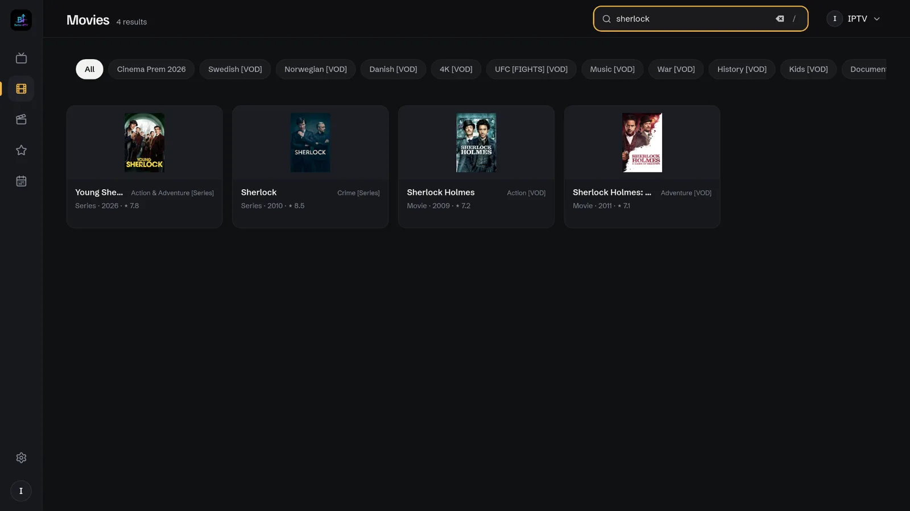
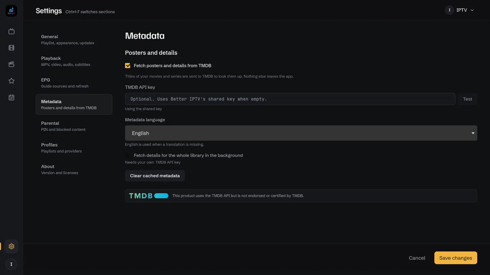

<div align="center">
  

  # Better IPTV

  **A dark, content-first IPTV player for Linux, Windows and macOS**

  [](https://github.com/mewset/better-iptv/actions)
  [](#-installation)
  [](https://aur.archlinux.org/packages/better-iptv)
  [](LICENSE)
  [](https://better-iptv.vercel.app)

  [Website](https://better-iptv.vercel.app) • [What you get](#-what-you-get) • [Installation](#-installation) • [Getting started](#-getting-started) • [FAQ](#-faq) • [Contributing](#-contributing)
</div>

> **Note:** Better IPTV is a player, not a provider. It plays the playlists you bring. You are responsible for following your provider's terms and your local laws.

<div align="center">
  
</div>

---

## 📺 What is Better IPTV?

Better IPTV is a desktop app for watching IPTV: live channels, movies and series from an M3U playlist or an Xtream Codes provider. It keeps everything on your computer, plays video through MPV, and stays quick even with a playlist of 150,000 channels.

- **Made to browse.** Posters, ratings and plots from TMDB, a TV guide, and a dark interface built around the content rather than around menus.
- **Made to keep private.** Your playlists, credentials and history never leave your machine. The only things the app talks to are your provider, TMDB (titles only, and only when you keep it on) and GitHub (to check for updates).
- **Made to last.** One SQLite file holds your data. Delete it and the app is back to first launch. Nothing phones home.

---

## ✨ What you get

### Live TV
- Channels grouped the way your provider groups them, with a category bar for quick filtering and a Favorites section for the ones you actually watch
- The current and next programme on every channel card, with a progress line showing how far the programme has come
- A **TV Guide** (press `G`): what is on now and next across your channels, with a "Watch now" button on any programme

&nbsp;

### Movies and series
- Real posters, year and rating on every card, fetched from [TMDB](https://www.themoviedb.org/)
- A Home page with daily genre slideshows of the best-rated movies and series in your playlist (needs your own TMDB key with the background scan on)
- A **detail page** for each title: backdrop, plot, cast, a trailer link, and for series the seasons and episodes
- **Series playback that queues the rest of the season**, for Xtream and for M3U playlists that name their episodes (`Show S01E02`, `Show 1x02`, `Show Season 1 Episode 2`)
- A "Recently added" banner at the top of Movies and Series, showing the newest title your provider added
- Wrong poster? "Wrong title?" on the detail page lets you pick the right match, or mark a title as not on TMDB

&nbsp;

### Search and navigation
- Search across everything (press `/`), instant even on huge playlists
- A side rail for Home (when you use your own TMDB key with the background scan on), Live TV, Movies, Series, Favorites and the TV Guide; search and the profile switcher at the top
- Keyboard shortcuts for the things you do all the time (see below)



### Profiles
- One profile per playlist or provider; switch between them from the top-right menu, and add a new one from the same place
- Each profile keeps its own favorites, language preferences and playlist refresh

### Parental controls
- A 4–6 digit PIN, hashed with Argon2, that locks the controls
- Block channels by hand, block whole categories, or let the app pick out adult content by its labels
- Blocked channels can be hidden, shown with a lock, or blurred; unlocking lasts until you close the app

### Playback
- MPV does the playing: hardware acceleration, every codec, HLS, RTSP and RTMP streams
- Choose the video renderer, deinterlacing, start volume, fullscreen at start and how many seconds to buffer
- Preferred audio and subtitle languages (18 languages), passed to MPV for every stream
- If a stream cannot be played, the app tells you instead of doing nothing

### Looks
- Dark by default, with a light theme in Settings → General
- New fonts, a floating now-playing dock, and a colour-bar placeholder for channels without a logo

---

## 📥 Installation

### 1. MPV

Better IPTV plays video through [MPV](https://mpv.io/), in its own window.

**Windows:** nothing to do. MPV is included in the installer.

**Linux and macOS:** install MPV first.

```bash
sudo apt install mpv      # Ubuntu/Debian
sudo pacman -S mpv        # Arch Linux
sudo dnf install mpv      # Fedora
brew install mpv          # macOS
```

### 2. Better IPTV

Download from [Releases](https://github.com/mewset/better-iptv/releases/latest):

| Platform | File |
|----------|------|
| Windows | `Better.IPTV_<version>_x64-setup.exe` (or the `.msi`) |
| Ubuntu/Debian | `Better.IPTV_<version>_amd64.deb` or `Better.IPTV_<version>_amd64.AppImage` |
| Fedora/RHEL | `Better.IPTV-<version>-1.x86_64.rpm` |
| Arch/Manjaro | AUR (below), or `Better.IPTV_<version>_amd64-arch.AppImage` |
| macOS (Apple Silicon) | `Better.IPTV_<version>_aarch64.dmg` |

**Arch/Manjaro via the AUR:**
```bash
yay -S better-iptv-bin   # prebuilt
yay -S better-iptv       # meta-package, pulls in better-iptv-bin
```

<details>
<summary><strong>Two AppImages, which one?</strong></summary>

The standard AppImage bundles WebKit libraries built on Ubuntu. On a distro with a current `webkit2gtk` (Arch, Manjaro, Fedora) those clash, and the app opens a white window or dies with `Could not create default EGL display`. The `-arch` AppImage uses your system's `webkit2gtk` instead, so despite the name it is the right file on any distro with recent libraries.

It bundles nothing, so it needs `webkit2gtk-4.1`, `gtk3` and `mpv` from your distro, and tells you if they are missing:

```bash
sudo pacman -S webkit2gtk-4.1 gtk3 mpv      # Arch/Manjaro
sudo dnf install webkit2gtk4.1 gtk3 mpv     # Fedora

chmod +x Better.IPTV_*_amd64-arch.AppImage
./Better.IPTV_*_amd64-arch.AppImage
```
</details>

---

## 🚀 Getting started

### Add your playlist

The first screen asks for one playlist. Give it a name, then either:

- **M3U:** paste the playlist URL, or the path to a `.m3u` file on your computer
- **Xtream Codes:** enter the server URL, username and password from your provider

Click **Add playlist**. Live TV, Movies and Series import together. More playlists can be added later from the profile menu in the top-right corner.

### Watch

- Pick a section in the side rail, use the category bar to narrow it down, or press `/` and type
- Click a channel to play it. MPV opens in its own window; the app shows what is playing in a dock at the bottom
- Click a movie or series to open its detail page, then **Play** (or **Play S1 E1** for a series). The rest of the season queues automatically
- Hover a card and click the star to add it to Favorites

### The programme guide

Xtream providers usually deliver a guide with the playlist, and the app picks it up on its own. For an M3U playlist, open **Settings → EPG** and paste an XMLTV URL. The guide refreshes itself every six hours while the app runs.

### Posters and details

TMDB metadata is on from the start and needs no account. Under **Settings → Metadata** you can:

- turn it off, if you would rather not have titles looked up
- choose the language for plots and titles
- add your **own TMDB API key** (free at [themoviedb.org](https://www.themoviedb.org/settings/api)), which also unlocks fetching details for your whole library in the background

When metadata is on, the app sends the names of your movies and series to TMDB to find them. Nothing else leaves the app.



---

## ⌨️ Keyboard shortcuts

| Key | Action |
|-----|--------|
| `Space` | Play or stop the selected channel |
| `/` | Focus the search box |
| `G` | Open or close the TV Guide |
| `Escape` | Close the guide, a detail page or Settings; otherwise stop playback |
| `Ctrl+1` … `Ctrl+7` | Jump between Settings sections |

For controls inside the video window (fullscreen, volume, seeking), see the [MPV keyboard reference](https://mpv.io/manual/stable/#keyboard-control).

---

## 🔒 Privacy

Everything Better IPTV knows about you is in one SQLite file on your computer (locations below). There is no account, no telemetry and no analytics.

The app makes three kinds of network requests:

| To | What | When |
|----|------|------|
| Your provider | Playlist, guide, streams | Always |
| TMDB | The names of your movies and series | While metadata is on (default), never for live channels |
| GitHub | A version check | Once a day, can be turned off in Settings → General |

Your provider credentials are stored locally and masked in the log file, so a log is safe to attach to a bug report.

---

## ❓ FAQ

<details>
<summary><strong>Why does video open in a separate window?</strong></summary>

Because MPV plays it. That is what gives you every codec, hardware acceleration and MPV's own controls. The app window stays for browsing; the video window is MPV's.
</details>

<details>
<summary><strong>MPV does not open</strong></summary>

On Linux and macOS MPV has to be installed (`mpv --version` should print a version). On Windows it is bundled, so this should not happen; if it does, file a bug with your log.
</details>

<details>
<summary><strong>No guide data on a channel</strong></summary>

The playlist must carry an EPG id for the channel (`tvg-id` or `tvg-name` in an M3U), the guide URL must be set (Settings → EPG, automatic for Xtream), and the guide must have been downloaded (Settings → EPG → Update now). Cards re-read the guide within a minute.
</details>

<details>
<summary><strong>A movie has no poster, or the wrong one</strong></summary>

No poster means TMDB found nothing for the provider's name of the title; the app keeps the provider's artwork. The wrong poster means it found the wrong title. Open the title and use **Wrong title?** to search TMDB yourself, or mark it as not on TMDB.
</details>

<details>
<summary><strong>Do I need a TMDB account?</strong></summary>

No. The app ships with a shared key that covers normal browsing. Your own key (free) is only needed if you want the whole library fetched in the background, or if the shared key ever stops working.
</details>

<details>
<summary><strong>How many channels can it handle?</strong></summary>

Playlists of 150,000+ channels have been used during development without trouble. The grid only renders what is on screen.
</details>

<details>
<summary><strong>Does it work with a VPN?</strong></summary>

Yes. Turn the VPN on before you start a stream.
</details>

<details>
<summary><strong>Can I play local video files?</strong></summary>

No. Better IPTV is for streams. MPV itself plays local files well.
</details>

<details>
<summary><strong>I forgot my parental PIN</strong></summary>

Delete `better-ip-tv.db` from the data folder below and add your playlist again. There is no recovery by design.
</details>

---

## 🛠️ Troubleshooting

**Channels buffer.** It is usually the provider's server. Try another channel, and raise the buffer in Settings → Playback → Cache.

**Series missing after an Xtream import.** Not every provider offers series through the API. Check your credentials and refresh the playlist from Settings → Profiles.

**The app does not start.**
- Linux: `chmod +x` the AppImage. A white window or an `EGL_BAD_PARAMETER` crash means you want the `-arch` AppImage (see Installation)
- Windows: check that Windows Defender did not quarantine it
- macOS: allow the app under System Settings → Privacy & Security

**Where your files are**

| | Data (`better-ip-tv.db`) | Log (`better-ip-tv.log`) |
|---|---|---|
| Linux | `~/.local/share/com.m0s.better-ip-tv/` | `~/.local/share/com.m0s.better-ip-tv/logs/` |
| Windows | `%APPDATA%\com.m0s.better-ip-tv\` | `%LOCALAPPDATA%\com.m0s.better-ip-tv\logs\` |
| macOS | `~/Library/Application Support/com.m0s.better-ip-tv/` | `~/Library/Logs/com.m0s.better-ip-tv/` |

Settings → About has an **Open logs folder** button.

---

## 🤝 Contributing

Bug reports, feature ideas and pull requests are welcome. [CONTRIBUTING.md](CONTRIBUTING.md) has the development setup and the rules for PRs.

- [Report a bug](https://github.com/mewset/better-iptv/issues/new)
- [Suggest a feature](https://github.com/mewset/better-iptv/issues/new)
- [Discussions](https://github.com/mewset/better-iptv/discussions), where every release is announced

Built with Rust, [Tauri](https://tauri.app/), React and [MPV](https://mpv.io/).

---

## 📝 Changelog

[CHANGELOG_USER.md](CHANGELOG_USER.md) lists what changed in each version, in plain words.

---

## 📄 License

[GNU General Public License v2.0](LICENSE).

This product uses the TMDB API but is not endorsed or certified by TMDB.

---

## 🙏 Acknowledgments

- **[MPV](https://mpv.io/)** for the playback
- **[Tauri](https://tauri.app/)** for the cross-platform shell
- **[TMDB](https://www.themoviedb.org/)** for the posters, plots and cast
- **[Open TV](https://github.com/Fredolx/open-tv)** for showing the way
- Everyone who has filed an issue, reviewed the UI or sent a fix

---

## 💖 Support the project

Better IPTV is built by one person in their spare time. If it is useful to you:

- **Ko-fi**: [ko-fi.com/R6R21I53PD](https://ko-fi.com/R6R21I53PD)
- **GitHub Sponsors**: [github.com/sponsors/mewset](https://github.com/sponsors/mewset)

| Crypto | Address |
|--------|---------|
| ETH | `0x47183F4e4FEAeE4BF52d95E68893e950125b1B44` |
| BTC | `bc1qth40h9t8r7hvp4czqvf20f3w72jdg4epd5mjq8` |
| SOL | `3waxf6r2tmaaADuBGYoVD5qz4z8VnFNEGGafbXZ6Jf2j` |
